# Администрирование БД

### Отчет по лабораторной работе №1.

### Выполнил: Александров Михаил Максимовчи ИС-22

# Ход выполнения

## Подготовка среды и установка PostgreSQL

Для начала выполнения работы была запущена виртуальная машина на системе Debian 12, с последующей установкой прав основного пользователя и скачиванием PostgreSQL 15 версии. Так же был настроен SSH тунель для удобства выполнения.

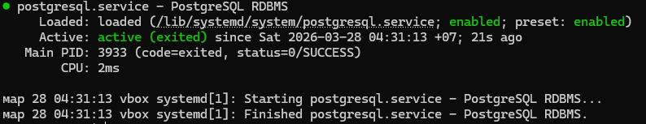

## Проверка учетной записи postgres

## Первичная настройка конфигурационных файлов

В **postgresql.conf** настроен прослушиваемый адрес. Был выставлен *.
В **pg_hba.conf** поставлены настройки для подключения к базе postgres с пользователем aleksandrovmm и доступом по поролю

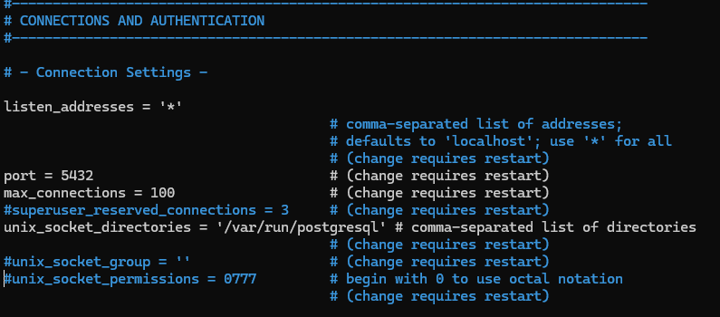

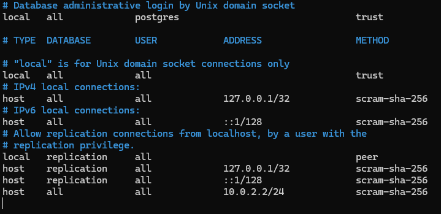

## Управление сервисом
С помощью команды systemctl status postgresql проверяем состояние службы PostgreSQL

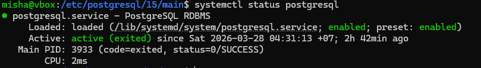

Для автоматического запуска в **start.conf** поставлен флаг auto для автозапуска вместе с ОС

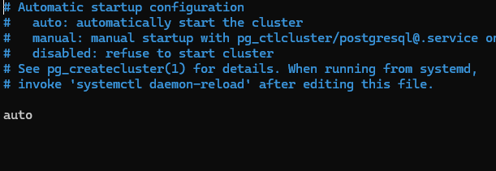

## Создание тестовой базы данных

В данном пункте нужно было создать отдельного пользователя, новую базу данных и использовать psql, чтобы проверить доступ к ней. Создание пользователя выполняется с помощью **CREATE USER**, а создание базы данных **CREATE DATABASE**.

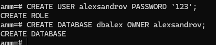

Затем для проверки доступа была выполнена команда psql

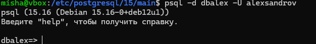

## Работа со схемой

Для взаимодействия со схемой была создана схема **test_cheme** и установлен путь поиска на нее. Для демонстарции была создана таблица и проведено два select запроса с учетом схемы и без нее.

Так как схема не была указана при создании, а путь поиска настроен на test_cheme, то таблица была создана именно в этой схеме.

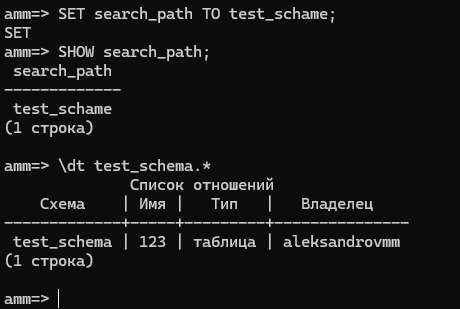

## Использование утилиты psql для базовых операций 

В данном пункте нужно было в схеме public создать таблицу и внести несколько записей с помощью основных SQL-запросов:

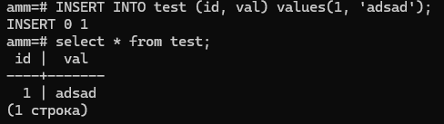

## Настройка локальных и сетевых подключений

Чтобы настроить доступ к базе данных по локальной сети нужно изменить параметр listen_addresses в файле postgresql.conf, который определяет, на каких сетевых интерфейсах сервер принимает входящие подключения. Было выставлено значение '*', что разрешает подключение с любых сетевых адресов, а не только с localhost.

После внесения изменений сервис PostgreSQL был перезапущен для применения настроек. Теперь нужно было произвести подключение через pgadmin или dbeaver с локальной машины. Для подлкючения к бд был выбран pgadmin, в нём был указан IP-адрес виртуальной машины, порт (5433), имя базы данных и учётные данные пользователя

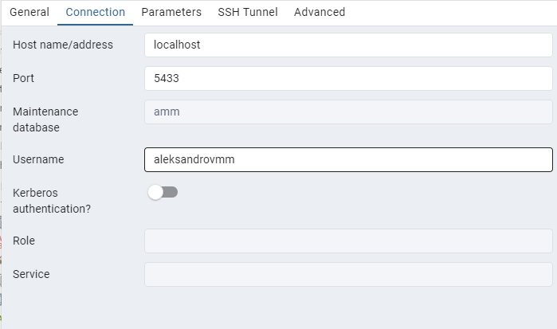

Подключение выполнено успешно

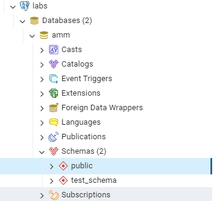

## Логирование

Для настройки логирования, необходимо было выставить следующие значения в файле **postgresql.conf**:

- logging_collector=true (включение логирования)
- log_directory = '/etc/postgresql/15/main/logs' (кастомная директория логирования)
- log*filename = 'postgresql-%Y-%m-%d*%H%M%S.log'
- log_connections = on

Результат настройки:

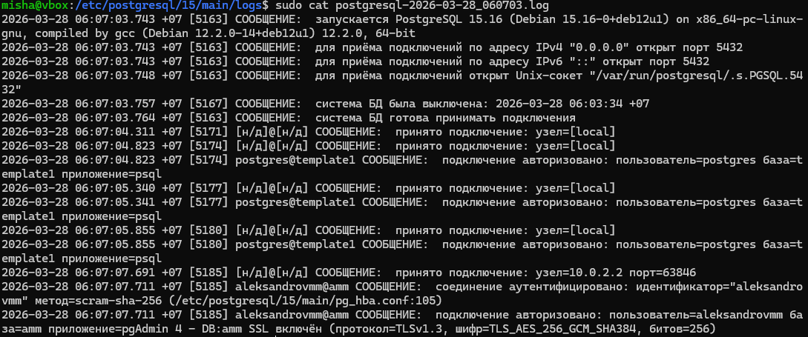

## Роль

Для создания роли необходимо войти в Psql или подключится к pgAdmin через роль Postgres.

В рамках этого пункта была создана роль **aleksandrovmm**, у которой только была возможность авторизации.

Дальнейшие привелегии добавляются через ALTER ROLE.

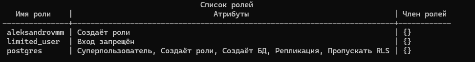

# Вывод

В ходе выполнения лабораторной работы на виртуальную машину Debian была установлена СУБД PostgreSQL, изучены конфигурационные файлы и проведена настройка для подключения к pgAdmin. В рамках работы с самими базами данных создана схема и роль, с дальнейшей выдачей прав на использования.